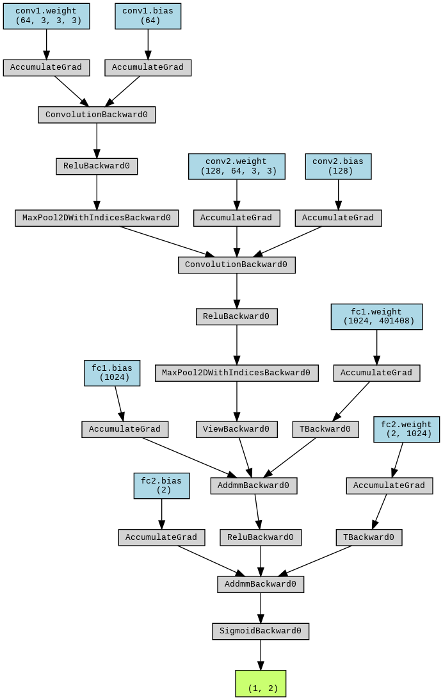

# Car Image Scorer
A deep learning network that predicts the quality of pictures of cars for the use of damage assessment.

## Task
The task is to train a deep learning model to predict whether certain parts of a car are clearly visible in a given image. The predicted score should lie between **0.0** and **1.0**, where a score of 0.0 indicates that the part is not visible and a score of 1.0 means that the car part is clearly visible and in good light.

## Data
The dataset consists of 4000 synthetic images of cars from different angles and perspectives. For each image scores indicating the visibility of the hood and the left back door of the car are given.

## Model
Since we are doing a regression task on images, I have decided to implement a simple convolutional neural network (CNN). CNNs are great at deep learning tasks involving pictures as input, e.g. object detection, image classification, or image segmentation. They usually consist of convolutional layers and pooling layers followed by fully connected linear layers to produce the desired output.

## Training
The following cell implements the training loop for learning the correct weights of our model. The weights are updated based on a given learning rate of **lr=0.001** and the mean-squared-error (**MSE**) loss function.